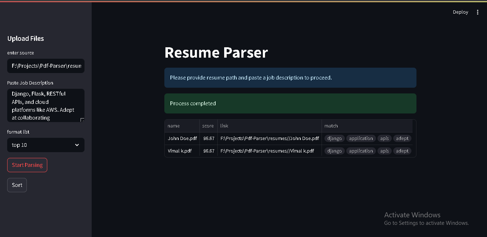

# 📄 Resume Parser

**Resume Parser** helps you parse and analyze resumes against a job description to find the best-matched candidates for a job vacancy.

## 🚀 Features

* Select a source (e.g., folder) to fetch resumes
* Input a job description for matching
* Automatically compares resumes using NLP techniques
* Generates a summary of top-matching resumes
* User-friendly **Streamlit** GUI

## 🛠️ Technologies Used

* **Language:** Python
* **GUI Toolkit:** Streamlit
* **Libraries Used:**

  * `streamlit`
  * `PyPDF2`
  * `python-docx`
  * `spacy`
  * `pandas`
  * `fpdf`
  * `json`
  * `os`
  * `io`

## 📁 How It Works

1. **User selects a source** directory to fetch resume files and provides a job description.
2. Each document is parsed and processed using NLP techniques.
3. Resumes are scored based on keyword matching and relevance to the job description.
4. A summary of matching resumes is displayed, and results can be sorted by match score.

## 💻 Setup & Usage

1. Clone the repository:

   ```bash
   git clone https://github.com/VIshnu12Vk/python-RESUME-PARSER
   python-RESUME-PARSER
   ```

2. Install the required dependencies:

   ```bash
   pip install -r requirements.txt
   ```

3. Run the Streamlit app:

   ```bash
   streamlit run main.py
   ```

---
## screenshot


